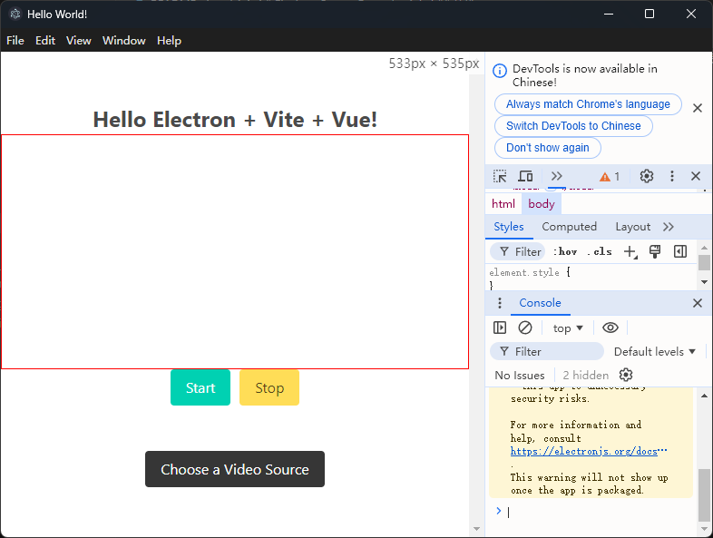
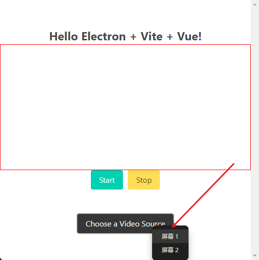
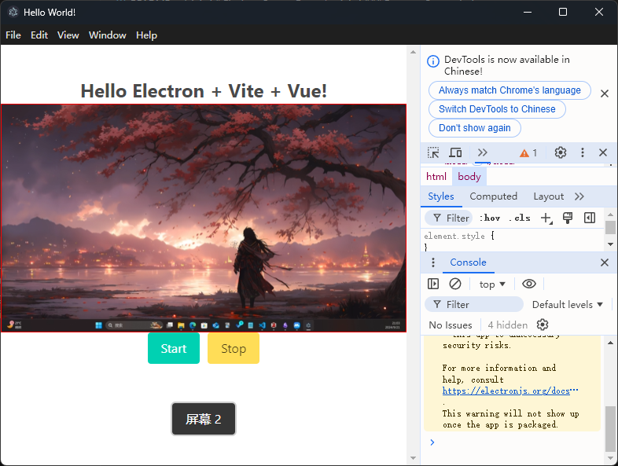

# Electron Screen Recorder

[中文版](README_zh.md)

This project is a screen recording application built using Electron, Vite, and Vue.js. It allows users to select a video source (such as a screen) and record it. The recorded video is saved in WebM format. The app demonstrates the use of Electron's desktop capture functionality and Vue.js for building a simple front-end interface.

### Running Screenshots





### Features
`Screen Capture`: Allows users to select a screen or window to capture using Electron's desktopCapturer.

`Video Recording`: Users can start and stop recording the selected video source.

`Save Video`: Once the recording is stopped, the app prompts the user to save the recording as a .webm file.

`Responsive UI`: Built with Vue.js and styled for responsiveness.


### Technologies Used
Electron: Desktop application framework for building cross-platform apps with web technologies.

Vite: Fast and lightweight build tool optimized for modern web development.

Vue.js: Front-end framework for building responsive user interfaces.

JavaScript/HTML/CSS: Core web technologies used to create the user interface.

### Installation
To run this project locally, follow these steps:

Clone the repository:
```node
git clone https://github.com/qq13456116532/Electron-Screen-Recorder.git
cd electron-screen-recorder
```
Install dependencies:
```node
npm install
```
Start the application:
```node
npm start
```

### How It Works
1. The user can choose a video source (such as a screen or a window) using the "Choose a Video Source" button.

2. Once the video source is selected, the screen will be displayed in the `<video>` element.

3. Clicking "Start" will begin the recording. Clicking "Stop" will end the recording and prompt the user to save the video file.

4. The video is saved as a .webm file using Electron's file system API.

### File Descriptions
- main.js: The Electron main process file that handles creating the window, capturing the screen, and managing video sources.
- preload.js: Exposes safe APIs to the renderer process through Electron's contextBridge.
- App.vue: The Vue.js component that manages the UI and screen recording logic.
- index.html: The main HTML file that renders the Vue.js application.
### Usage
1. Select a video source using the "Choose a Video Source" button.
2. Click the "Start" button to begin recording the selected video source.
3. Click the "Stop" button to stop the recording and save the video file.
### License
This project is licensed under the MIT License. See the LICENSE file for details.

### Acknowledgments
Thanks to the Electron, Vite, and Vue.js communities for their amazing documentation and resources.