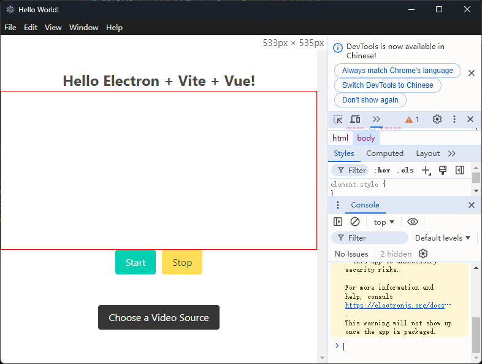

# Electron Screen Recorder

[English Version README](README.md)

这个项目是一个使用 Electron、Vite 和 Vue.js 构建的屏幕录制应用程序。它允许用户选择一个视频源（例如屏幕）并进行录制。录制的视频将保存为 WebM 格式。该应用展示了如何使用 Electron 的桌面捕获功能以及 Vue.js 来构建一个简单的前端界面。

## 程序运行截图



## 功能

- **屏幕捕获**：允许用户使用 Electron 的 `desktopCapturer` 选择屏幕或窗口进行捕获。
- **视频录制**：用户可以开始和停止录制所选择的视频源。
- **保存视频**：录制结束后，应用会提示用户将视频保存为 `.webm` 文件。
- **响应式界面**：使用 Vue.js 构建，并经过响应式设计，适应不同屏幕尺寸。


## 使用技术

- **Electron**：用于构建跨平台桌面应用的框架。
- **Vite**：快速轻量的构建工具，优化了现代 web 开发。
- **Vue.js**：前端框架，用于构建响应式用户界面。
- **JavaScript/HTML/CSS**：用于创建用户界面的核心 web 技术。

## 安装步骤

要在本地运行此项目，请按照以下步骤操作：

1. **克隆代码库**：
   ```bash
   git clone https://github.com/qq13456116532/Electron-Screen-Recorder.git
   cd electron-screen-recorder
   ```
2. **安装依赖**:
   ```node
   npm install
   ```
3. **启动应用程序：**
   ```node
   npm start
   ```

### 工作原理
1. 用户可以使用“选择视频源”按钮选择视频源（如屏幕或窗口）。

2. 一旦选择了视频源，屏幕将显示在 `<video>` 元素中。

3. 点击“开始”将开始录制。点击“停止”将结束录制，并提示用户保存视频文件。

4. 视频将使用 Electron 的文件系统 API 保存为 .webm 文件。

### 文件描述
- main.js：Electron 主进程文件，负责创建窗口、捕捉屏幕和管理视频源。
- preload.js：通过 Electron 的 contextBridge 向渲染进程暴露安全的 API。
- App.vue：管理 UI 和屏幕录制逻辑的 Vue.js 组件。
- index.html：渲染 Vue.js 应用的主 HTML 文件。
### 使用
1. 使用“选择视频源”按钮选择视频源。
2. 点击“开始”按钮开始录制选定的视频源。
3. 点击“停止”按钮停止录制并保存视频文件。
### 许可
该项目在 MIT 许可下授权。详见 LICENSE 文件。


### 致谢
感谢 Electron、Vite 和 Vue.js 社区提供的出色文档和资源。


